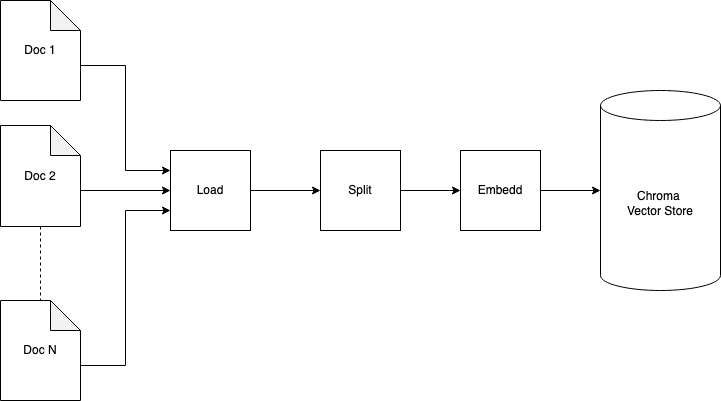

# Folder setup
- `bin` has all the fine-tuned models downloaded from huggingface
- `data` contains the data. Results (`*.csv`) are also saved here.
    - `data/rel18` has the documents for training
    - `data/vectorstore` has chroma vectorstore dbs
  
- `notebooks` containes jupyter notebooks
- `scripts` contains python scripts.
- `lib` contains helper functions.
- `results` contains results in CSV format
- `driver.py` is a program that helps execute the various steps from ingesting data to running inference to obtain results.


The system used had the following specification 
|Spec|Value|
|----|-----|
|RAM | 62 GB|
|Swap| 50 GB|
|CPU| 24|
|GPU Count|2|
|GPU RAM|2 x 11.264 GB |

# Loading data into Vectorstore
Start chromadb service to run on localhost and port 8000 as specified in the configuration. 
```bash
chroma run --path data/vectorstore/${vectorstore_name}/
```

Execute the driver and specify the `load-docs` subcommand to load all of the documents into the vectorstore.
```bash
python driver.py load-docs  -c ${config_name}
```   
## Loading process
When the command is executed to load all documents each document is split using the ,[RecursiveCharacterTextSplitter](https://api.python.langchain.com/en/latest/character/langchain_text_splitters.character.RecursiveCharacterTextSplitter.html), into the configured chunk_size using the specified overlap. All splits are then embedded using the specified embedding model and then stored in the chroma vectorstore. [Chroma is thread-safe but not process-safe](https://cookbook.chromadb.dev/core/system_constraints/) therefore since we are doing multiprocessing here we are discouraged from accessing the db using the filesystem but rather stand up the server and connect to it. 




# Fintuning the LLM model
## Building the training prompts
To fine-tune the model we have to build the training prompt first. Execute the command below to build the prompt file. I had to separate this step from the actual training step in order to clean up and reserve enough memory for the training stage.
```bash
python driver.py build-finetune-prompt
```
## Training the model
With the training prompt binary file  in place execute the following script to mint a [LoRA](https://arxiv.org/abs/2106.09685) fine-tunned model. When training set the `common.compression_retriever_top_n` value to `2` in order to fit into limited GPU memeory. 
```bash
python driver.py fine-tune-model -c ${config_name}
```

## Bulding inference prompt
In order to build prompt for inference execute the command below
```bash 
python driver.py build-inference-prompt -c ${config_name}
```
The `inference.*` section of the configuration determines what the command does. The following run modes are supported.

|Run Mode| Action |
|--------|--------|
| `0`      | Only training data|
| `1`      | Only testing data|
| `2`      | Both training and test data. *This requires lots of memory*| 

## Retreival process
During retrieval the question is used in two different kinds of searches, similarity and maximal marginal relevant approaches. The results is merged and then duplicates are removed. Using the reranker model the remaining results are ordered and then the top N results are selected. The selected results are then reordered in order to keep the most relevant results at the beginning and end of the context. This retrieval process is used during the inference and training prompt build process. 


## Running inference
Execute the following command to run inference using the trained model and the inference prompt generated.
```bash
python driver.py test-model -c ${config_name}
```

# Reproducing Results
Set the following parameters to the values specified at the following stages in order to reproduce the results. Set the following configuration when building prompt and finetuning the model. We observed the best performance using the following configuration.

## Common config
|Parameter|Value|
|---------|-----|
|`common.embedding_model.name`|`all-MiniLM-L6-v2.gguf2.f16.gguf`|
|`common.reranker_model`|`BAAI/bge-reranker-base`|
|`common.vectorstore.k`|`200`|
|`data-ingest.textsplitter.chunk_size`|`512`|
|`data-ingest.textsplitter.overlap`|`150`| 

## Training
|Parameter|Value|
|---------|-----|
|`common.vectorstore.compression_retriever_top_n`|`2`|
|`inference.run_mode`|`0`|


## Inference
At inference time use the following
|Parameter|Value|
|---------|-----|
|`common.vectorstore.compression_retriever_top_n`|`5`|
|`inference.run_mode`|`1`|

# Summary
## Initial Setup
1) Start chroma server
``` bash
chroma run --path data/vectorstore/db/
```
2) Ingest data
``` bash
python driver.py load-docs  -c config-training.yaml
```
## Fine Tuning
3) Build fine-tune prompt
``` bash
python driver.py build-finetune-prompt  -c config-training.yaml
```
4) Fine-tune model
``` bash
python driver.py fine-tune-model  -c config-training.yaml
```
## Test model and generate result
5) Build inference prompt
``` bash
python driver.py build-inference-prompt  -c config-inference.yaml
```

6) Fine-tune model
``` bash
python driver.py test-model  -c config-inference.yaml
```